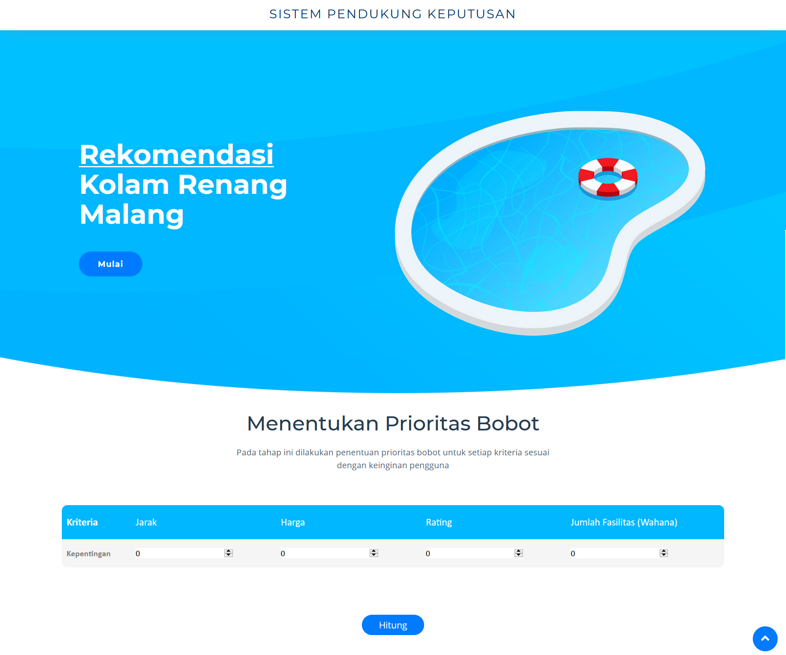

# Sistem Rekomendasi Kolam Renang Malang dengan Metode Weighted Product

Sistem Rekomendasi Kolam Renang Malang merupakan aplikasi berbasis web yang menampilkan rekomendasi kolam renang yang ada di wilayah kota Malang dengan menggunakan algoritma Weighted Product.

Alternatif kolam renang yang direkomendasikan pada sistem ini berbatas hanya pada 10 kolam renang saja, antara lain:
1. Taman Wisata Lembah Dieng
2. Permata Jingga Swimming Pool & Cafe
3. Kolam Renang Stadion Gajayana
4. Araya Family Club House Swimming Pool
5. Hawai Waterpark
6. Taman Rekreasi Selecta
7. Kolam Renang Lantamal Malang
8. Taman Rekreasi Tlogomas
9. Istana Dieng Club House
10. Pemandian Air Panas Cangar

Kriteria yang dimiliki aplikasi ini, antara lain:
1. Jarak (dari Universitas Brawijaya)
2. Harga (Rp)
3. Rating
4. Jumlah Fasilitas / Wahana

# Template

Aplikasi ini menggunakan template [NewBiz](https://bootstrapmade.com/newbiz-bootstrap-business-template/)
